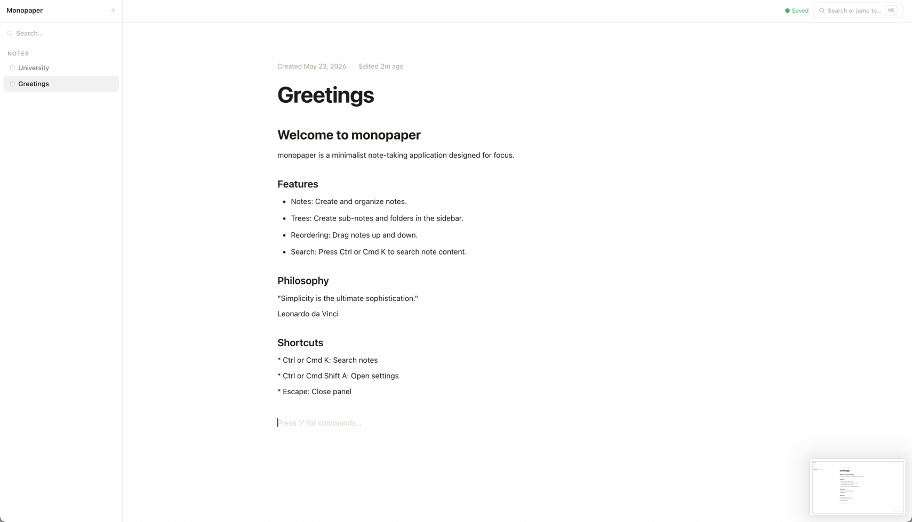

# Monopaper

A high-performance, minimalist, and open-source note-taking application engineered with a distraction-free user interface. Built with Laravel, React, InertiaJS, and TypeScript.



## Key Features

- **Minimalist & Distraction-Free:** Focus on writing with a clean, typography-focused aesthetic.
- **Nested Drag-and-Drop Sidebar:** Organize notes hierarchically with intuitive drag-and-drop projections.
- **Interactive Command Palette:** Press `⌘K` or `Ctrl+K` to search notes, create child notes, delete notes, or toggle preferences.
- **Novel Editor (Tiptap):** Rich-text editing with support for markdown shortcuts, slash commands, task lists, code block syntax highlighting, and inline formatting.
- **Tailored Typography & Layouts:** Customizable typography (Sans-Serif, Serif, Monospace), font sizes, line heights, and editor widths via the options panel.
- **Optimistic Autosave:** Automated background syncing with debounced network requests for absolute peace of mind.
- **Laravel Service Pattern Backend:** High-performance caching layers, database transaction safety, and clean separation of concerns.

---

## Tech Stack

- **Backend:** [Laravel 11+](https://laravel.com/)
- **Frontend:** [React 19](https://react.dev/), [InertiaJS v2](https://inertiajs.com/)
- **Styling:** Vanilla CSS (curated design system variables with CSS custom properties)
- **Editor:** [Tiptap](https://tiptap.dev/) / [Novel](https://novel.sh/)
- **Drag-and-Drop:** [@dnd-kit](https://dnd-kit.com/)

---

## Getting Started

### Prerequisites

**Manual:**
- PHP 8.2+
- Composer
- Node.js 18+ & NPM
- SQLite (default) or MySQL

**Docker:**
- [Docker](https://docs.docker.com/engine/install/) (v20+)
- [Docker Compose](https://docs.docker.com/compose/install/) (v2+)

### Installation

1. Clone the repository:
   ```bash
   git clone https://github.com/andiahmadysp/Monopaper.git
   cd Monopaper
   ```

2. Copy environment file:
   ```bash
   cp .env.example .env
   ```

#### Option A: Manual

3. Install dependencies:
   ```bash
   composer install
   npm install
   ```

4. Generate key and run migrations:
   ```bash
   php artisan key:generate
   touch database/database.sqlite
   php artisan migrate --seed
   ```

5. Start development servers (two terminals):
   ```bash
   php artisan serve
   ```
   ```bash
   npm run dev
   ```

#### Option B: Docker

3. Start containers:
   ```bash
   docker-compose up -d --build
   ```

Visit `http://localhost:8000` to start using **Monopaper**.

---

## Contributors

- [rshsyari](https://github.com/rshsyari) - Docker support

---

## Contribution

Please read [CONTRIBUTING.md](CONTRIBUTING.md) for details on our code of conduct and the process for submitting pull requests to the project.

---

## License

This project is licensed under the MIT License - see the [LICENSE](LICENSE) file for details.
